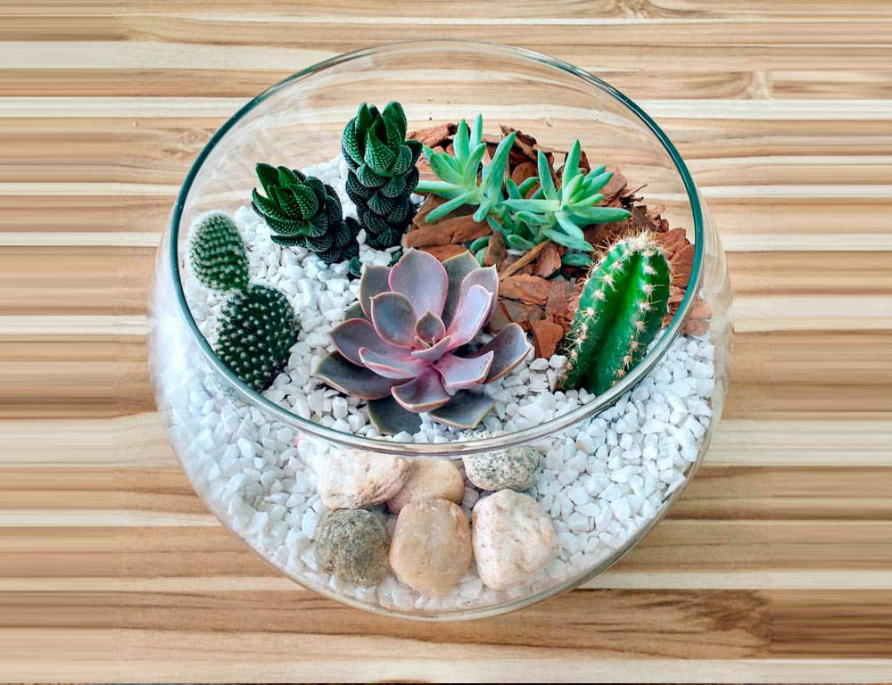

# Terrarium-2023-A

## Descripcion 
Proyecto de la clase de Programación web orientado a practicar las bases del código HTML +CSS + JS 💙

## Autor
.jpg)

Soy estudiante de TICS, me agrada la tecnologia y me gusta ayudar a solucionar problemas 
👌eedurdo04@hotmail.com
## Notas de clase 📝

1. HTML
2. CSS
3. Javascript